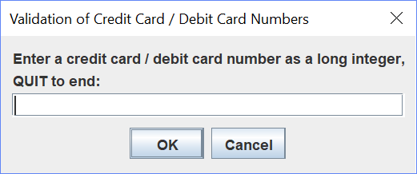
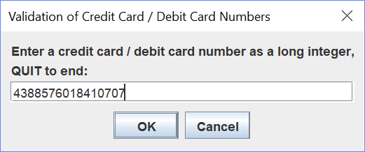
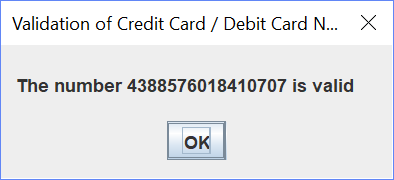
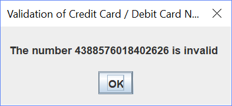
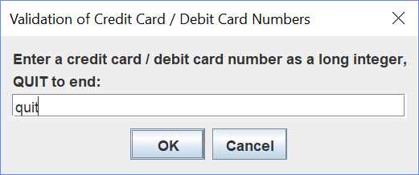

# Tugas Pemrograman 1

## Validasi Nomor Kartu Kredit / Kartu Debit dengan implementasi berbagai method

### Deskripsi Tugas

Buat sebuah **Java** project dan runnable JAR file untuk solusi soal 6.31 dari buku,

> **Introduction to Java Programming and Data Structures**, 10th Edition, by *Y. Daniel Liang*.

Pergunakan method ```showInputDialog``` dan method ```showMessageDialog``` dari class ```javax.swing.JOptionPane``` seperti yang dilakukan dalam Lab 03.

### Contoh interaksi dengan user:











