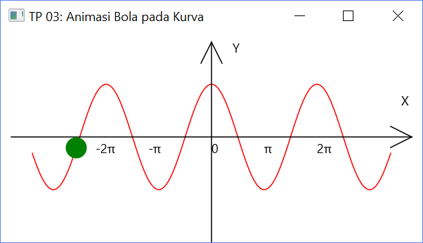
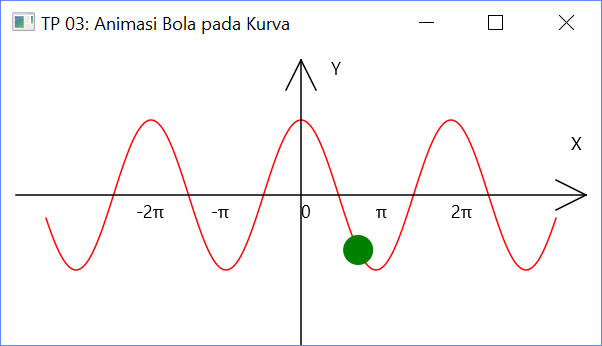
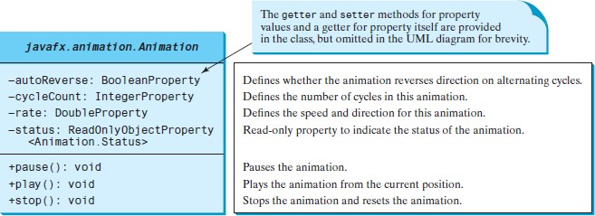
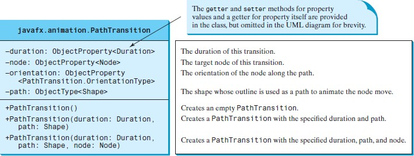
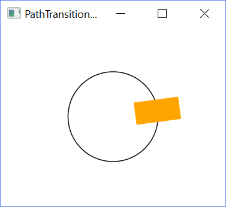

# Tugas Pemrograman 3

## Animasi dengan JavaFX

### Deskripsi Tugas

Bangun sebuah program **Java** dengan menggunakan library **JavaFX** yang melakukan animasi sebuah bola bergerak menelusuri sebuah kurva kosinus cos(x). Apabila bola telah mencapai batas kanan atau kiri, ia bergerak dalam arah sebaliknya dan seterusnya. User dapat pause atau resume animasi dengan klik tombol mouse kiri/kanan. Sumbu-sumbu koordinat dan kurva kosinus digambar dari awal sebagai object Line dan object ```Polyline```. Contoh tampilan adalah sbb.:




#### Untuk membantu Anda untuk menyelesaikan tugas di atas, berikut ini akan dipaparkan teknik-teknik animasi dengan JavaFX. Ikuti dengan cermat.

## Animation

**JavaFX** provides the ```Animation``` class with the core functionality for all animations. There are several ways to construct an animation program. An effective one is to use the subclasses of the **JavaFX** ```Animation``` class. The abstract Animation class provides the core functionalities for animations in **JavaFX***. Many concrete subclasses of ```Animation``` are provided in **JavaFX**, such as ```PathTransition```, ```FadeTransition```, and ```Timeline```.



The ```autoReverse``` is a ```Boolean``` property that indicates whether an animation will reverse its direction on the next cycle. The ```cycleCount``` indicates the number of the cycles for the animation. You can use the constant ```Timeline.INDEFINITE``` to indicate an indefinite number of cycles. The rate defines the speed of the animation. A negative rate value indicates the opposite direction for the animation. The status is a read-only property that indicates the status of the animation (```Animation.Status.PAUSED```, ```Animation.Status.RUNNING```, and ```Animation.Status.STOPPED```). The methods ```pause()```, ```play()```, and ```stop()``` will pause, play, and stop an animation, respectively.

The ```PathTransition``` class animates the moves of a node along a path from one end to the other over a given time. PathTransition is a subtype of Animation. The UML class diagram for the class is shown below.



The Duration class defines a duration of time. It is an immutable class. The class defines constants ```INDEFINITE```, ```ONE```, ```UNKNOWN```, and ```ZERO``` to represent an indefinte duration, one millisecond, unknown, and zero duration, respectively. You can use ```new Duration(double millis)``` to create an instance of Duration, the add, subtract, multiply, and divide methods to perform arithmetic operations, and the ```toHours()```, ```toMinutes()```, ```toSeconds()```, and ```toMillis()``` to return the number of hours, minutes, seconds, and milliseconds in this duration, respectively. You can also use ```compareTo``` to compare two durations. The constants ```NONE``` and ```ORTHOGONAL_TO_TANGENT``` are defined in ```PathTransition.OrientationType```. The latter specifies that the node is kept perpendicular (orthogonal) to the path’s tangent along the geometric path.

Program berikut melakukan animasi sebuah rectangle bergerak sepanjang outline dari sebuah circle, dengan arah bolak-balik secara terus-menerus. Dengan cursor dalam circle, pressing tombol mouse menghentikan animasi dan releasing tombol mouse meneruskan animasi.



```java
import javafx.animation.PathTransition;
import javafx.animation.Timeline;
import javafx.application.Application;
import javafx.scene.Scene;
import javafx.scene.layout.Pane;
import javafx.scene.paint.Color;
import javafx.scene.shape.Rectangle;
import javafx.scene.shape.Circle;
import javafx.stage.Stage;
import javafx.util.Duration;

public class PathTransitionDemo extends Application {
    
    @Override // Override the start method in the Application class
    public void start(Stage primaryStage) {
        // Create a pane, a rectangle, and a circle
        Pane pane = new Pane();
        Rectangle rectangle = new Rectangle (0, 0, 25, 50);
        rectangle.setFill(Color.ORANGE);
        Circle circle = new Circle(125, 100, 50);
        circle.setFill(Color.WHITE);
        circle.setStroke(Color.BLACK);

        // Add circle and rectangle to the pane
        pane.getChildren().add(circle);
        pane.getChildren().add(rectangle);

        // Create a path transition
        PathTransition pt = new PathTransition();
        pt.setDuration(Duration.millis(4000));
        pt.setPath(circle);
        pt.setNode(rectangle);
        pt.setOrientation(PathTransition.OrientationType.ORTHOGONAL_TO_TANGENT);
        pt.setCycleCount(Timeline.INDEFINITE);
        pt.setAutoReverse(true);
        pt.play(); // Start animation

        circle.setOnMousePressed(e -> pt.pause());
        circle.setOnMouseReleased(e -> pt.play());

        // Create a scene and place it in the stage
        Scene scene = new Scene(pane, 250, 200);
        primaryStage.setTitle("PathTransitionDemo"); // Set the stage title
        primaryStage.setScene(scene); // Place the scene in the stage
        primaryStage.show(); // Display the stage
    }

    public static void main(String[] args) { launch(args); }
}
```

The program creates a pane, a rectangle, and a circle. The circle and rectangle are placed in the pane. The program creates a path transition, sets its duration to 4 seconds for one cycle of animation, sets circle as the path, sets rectangle as the node, and sets the orientation to orthogonal to tangent. The cycle count is set to indefinite so the animation continues forever. The ```autoReverse``` is set to true so the direction of the move is reversed in the alternating cycle. The program starts animation by invoking the ```play()``` method.